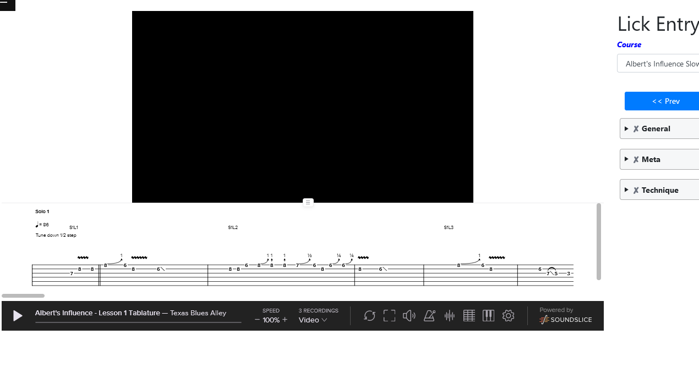

# [TXBA Lick Entry](https://script.google.com/macros/s/AKfycbyo-M3mNP5UrrJxnfe3-ncKWZMFUNTARkVbKEFTBKk/dev) 

- [TXBA Lick Entry](#txba-lick-entry)
  - [Purpose](#purpose)
  - [Composition](#composition)
  - [WorkFlow](#workflow)
  - [Features](#features)
    - [_Form validation_](#form-validation)
    - [_Navigation_](#navigation)
    - [_Search_](#search)
    - [_Embedded Soundslice Player_](#embedded-soundslice-player)
    - [_Options / Misc_](#options--misc)
      - [Settings and Utilities](#settings-and-utilities)
      - [Misc](#misc)

 ## Purpose
 TXBA wants to quantify all licks in all courses to determine playabilty categories. As of now, the criteria for a lick are as follows:

 * Total # of notes/note groupings
 * Timing Difficulty
 * Speed Difficulty
 * What "Blues Boxes" are we using
 * On which chord of the progression is the lick being played
 * Intensity
 * Picking Difficulty
 * Fingering Difficulty
 * Bending Count 
 * Legato Count
 * Has Slides?
 * Has Mutes?
 * Has Vibrato

  ## Composition
  Google Sheet - database
  Google Apps Script - backend
  ChartJS - display
  Datatables - display

  ## WorkFlow
  Choose Course -> Choose Lick -> Search for DB data -> Fill in form -> Save/Update 

 ## Features
 ### _Form validation_
 - Per section
  
  

 - Whole Form
  
  
  
  ### _Navigation_ 
  - By lick title 
    - Populated after choosing a course
    - Autocomplete
  
  - Prev/Next 
    - Provides easy movement between licks
  

  ### _Search_
  Automatically...
 1. retrieves lick data from spreadsheet 
    - (lick name, loop start and end)
 2. (with [Auto-play option](#autoplay)) Begins playing the selected link
 3. (with [Enable Landscape Graphs](#landscape)) shows the lick index
 

 ### _Embedded Soundslice Player_
 
  
  ### _Options / Misc_ 
  #### Settings and Utilities
  
- Enable Landscape Graphs (default = unchecked)
  - enables course landscape button
- Auto-play Licks (default = checked) 
- Course Landscape button (dual purpose)
  - view course landscape (req: Course title, no lick selected)
    - 
  - view lick landscape (req: Course title and lick)
    - 
- Set Lick 
  - selects/plays loop (req: Auto-play unchecked, Course title and lick)
- Read all 
  - displays the current data in the spreadsheet without having to open it

#### Misc
- Link to Google sheet 
  - open actual sheet in another tab
